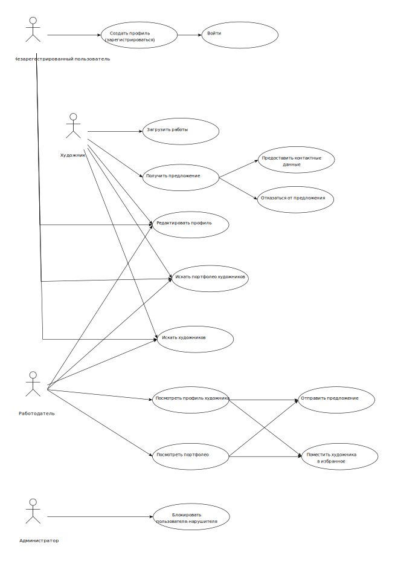
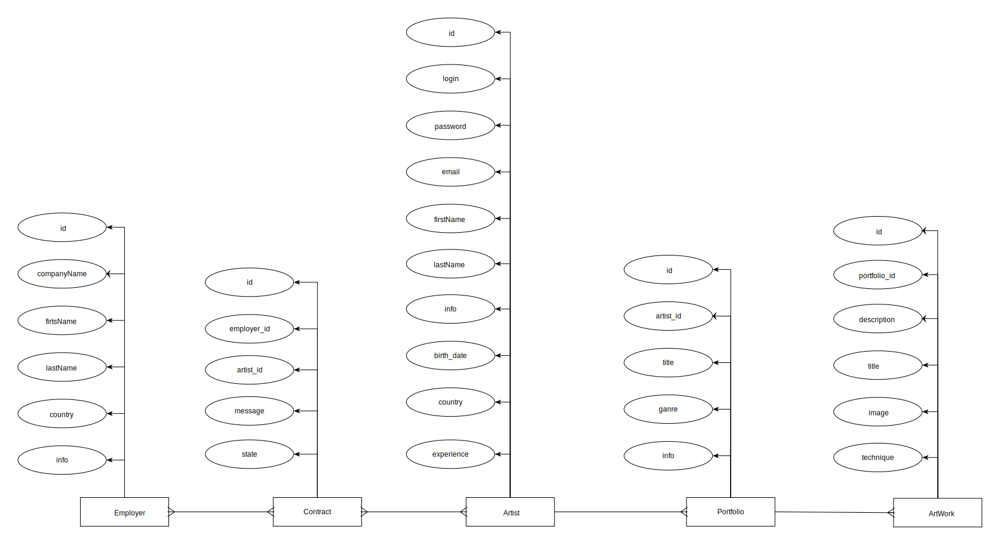
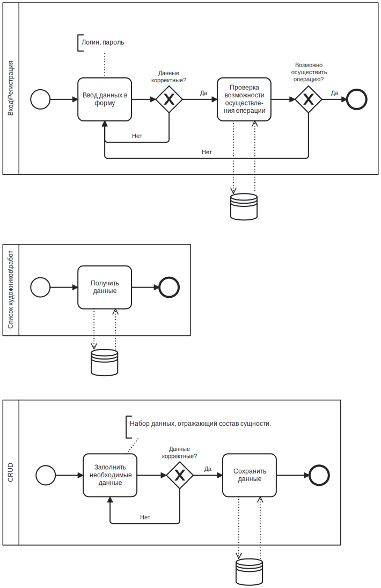
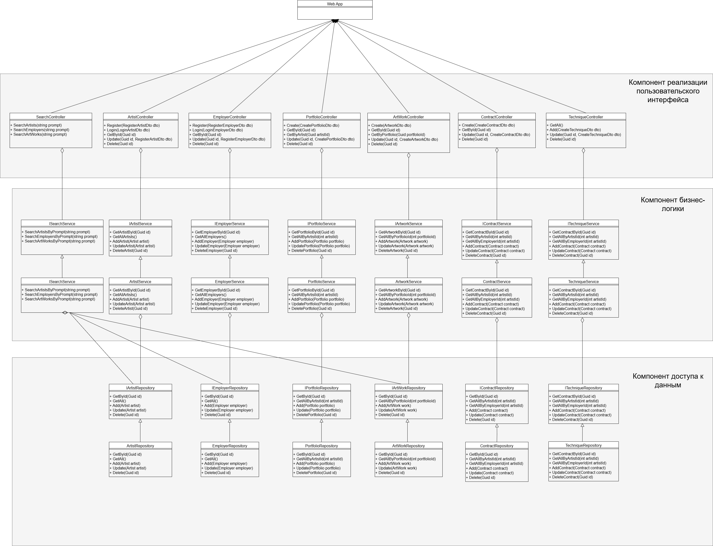
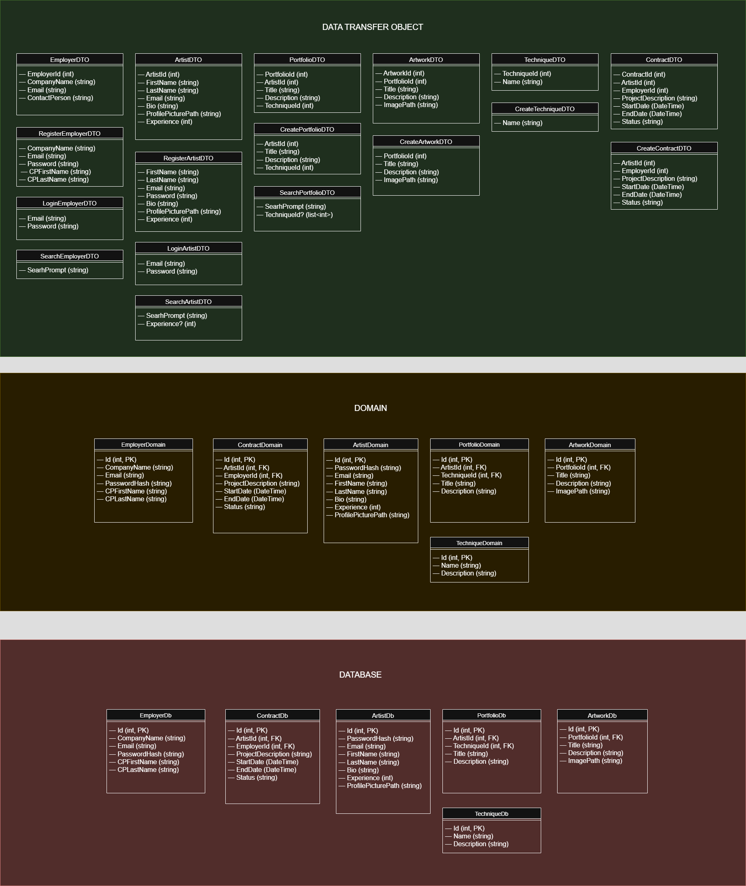

## Проектирование программного обеспечения, 2025
### Лабораторная работа № 1

## Название проекта

Сайт для рабочего портфолио художников «ArtLink».

## Краткое описание идеи проекта

«ArtLink» — это платформа, где художники и компании, которые их ищут, могут найти друг друга на основе работ художественного портфолио. Художники могут создавать профили, портфолио по разным жанрам и загружать туда свои работы. Работодатели могут искать интересующие их портфолио по опыту художника, технике и сфере деятельности. Художник может предоставить свои контакты работодателю, если посчитает это нужным.

# Краткое описание предметной области

Предметная область проекта связана с созданием и управлением цифровыми портфолио художников и поиском работы на их основе. Это включает в себя загрузку и хранение изображений, управление профилями пользователей, поиск и фильтрацию работ и портфолио по различным критериям.

# Краткий анализ аналогичных решений

| Имя проекта     | Краткое описание                                                                 | Отличия от «ArtLink»                                      |
|------------------|----------------------------------------------------------------------------------|-----------------------------------------------------------|
| **Behance**      | Платформа для творческих профессионалов, позволяющая создавать портфолио и делиться работами. | Больше ориентирован на показ работ, чем на поиск работы.  |
| **Dribbble**     | Сообщество дизайнеров, где они могут делиться работами и находить рабочие проекты.            | Ориентирован на дизайнеров, а не на художников.           |
| **ArtStation**   | Платформа для художников в области концепт-арта и 3D-моделирования.                           | Специализация на определенных жанрах искусства.           |
| **LinkedIn**     | Профессиональная сеть для поиска работы и создания сетей контактов.                           | Не специализирована на художниках и творческих профессиях.|

# Краткое обоснование целесообразности и актуальности проекта

«ArtLink» упрощает поиск талантливых художников для работодателей и предоставляет художникам платформу для демонстрации своих работ. Проект актуален, так как будет позволять работодателям искать художников на основе реальных работ, а не на основе текстового резюме, а также будет фокусироваться именно на художниках.

# Краткое описание акторов (ролей);

| Роль          | Описание                                                                                     |
|---------------|----------------------------------------------------------------------------------------------|
| **Художник**      | Пользователь, создающий профиль и загружающий портфолио, демонстрируя свои работы. Может получать предложения о сотрудничестве и предоставлять работодателю свои данные. |
| **Работодатель**   | Представитель компании или индивидуальный заказчик, ищущий художников для проектов. Может просматривать портфолио и отправлять предложения о сотрудничестве. |
| **Администратор**  | Пользователь, ответственный за блокировку пользователей, нарушающих правила сайта. Следит за соблюдением правил и обеспечивает безопасность сайта. |
| **Посетитель**    | Пользователь, который может просматривать платформу без регистрации. Может ознакомиться с работами художников, но не может взаимодействовать с другими пользователями. |

# Use-Case - диаграмма (обратить внимание на UML нотацию, отразить разных акторов пересечение их возможностей в приложении);



# ER-диаграмма сущностей (не путать с диаграммой БД – диаграмма сущность-связь не приземлена на конкретную СУБД и показывает сущности системы, в том числе те, которые не будут персистентно храниться);



# Пользовательские сценарии (не менее 3 типовых сценариев, в текстовом виде, расписанных по шагам, для разных акторов);
#### Сценарий 1: Художник создает профиль и загружает портфолио

1. **Регистрация**: Художник заходит на сайт «ArtLink» и нажимает на кнопку «Зарегистрироваться».
2. **Заполнение данных**: Художник заполняет форму регистрации, указывая имя, электронную почту и пароль.
3. **Подтверждение**: Художник получает письмо с кодом на указанную электронную почту и вводит его на сайте для подтверждения регистрации.
4. **Создание профиля**: После входа в систему художник заполняет свой профиль, добавляя информацию о себе, своих навыках и опыте.
5. **Загрузка работ**: Художник загружает изображения своих работ, организует их по жанрам и добавляет описания.
6. **Сохранение профиля**: Художник сохраняет изменения и публикует свое портфолио.
7. **Получение уведомлений**: Художник получает уведомление о том, что его профиль успешно создан и доступен для просмотра работодателями.

#### Сценарий 2: Работодатель ищет художника для проекта

1. **Вход на платформу**: Работодатель заходит на сайт «ArtLink» и вводит свои учетные данные для входа.
2. **Поиск художников**: Работодатель переходит в раздел поиска и использует фильтры для выбора художников по техникам и опыту.
3. **Просмотр портфолио**: Работодатель просматривает найденные портфолио, обращая внимание на работы и описания.
4. **Отправка предложения**: Работодатель нажимает на кнопку «Предложить сотрудничество» у выбранного художника, заполняет текстовое поле с описанием проекта и отправляет предложение.
5. **Ожидание ответа**: Работодатель ждет уведомления о том, что художник принял или отклонил предложение.

#### Сценарий 3: Администратор блокирует нарушителей на платформе

1. **Вход в админ-панель**: Администратор заходит на сайт «ArtLink» и вводит свои учетные данные для доступа к админ-панели.
2. **Просмотр пользователей**: Администратор переходит в раздел управления пользователями и просматривает список зарегистрированных художников и работодателей.
3. **Блокировка нарушителей**:  Администратор блокирует аккаунт пользователя, нарушающего правила использования.

# Формализация ключевых бизнес-процессов (либо один основной комплексный бизнес процесс, либо 3-4 декомпозированных, небольших, используя BPMN-нотацию).


### Лабораторная работа № 2

# Описание типа приложения и выбранного технологического стека
Для реализации данного проекта -- сайта -- выбран тип приложения Web SPA (Single Page Application). 

Технологический стек для проекта «ArtLink»:
1. Frontend (SPA):
Язык: TypeScript.

Фреймворк: React.js.

2. Backend (C#):
Язык: C#.

Фреймворк: ASP.NET Core.

База данных: PostgreSQL.

# Верхнеуровневое разбиение на компоненты (в следующих лабах сможете уточнить): на базовом уровне выделяем компонент доступа к данным, компонент бизнес-логики и компонент реализации UI. Отобразить диаграммой компонентов. Подумать про принцип инверсии зависимостей.



# UML диаграммы классов для двух отдельных компонентов - компонента доступа к данным и компонента с бизнес-логикой (не забыть «модельные» классов сущностей: сущности базы данных, сущности системы и транспортные сущности. Если уровень транспортных сущностей пока сложно спроектировать, можно скопировать системные. Уточните их на следующих этапах)


## Cборка и запуск

Для сборки проекта выполнить:
```bash
cd ArtLink
./build.bat
```

Далее для запуска проекта:
```bash
cd ../deploy
./run.bat
```
